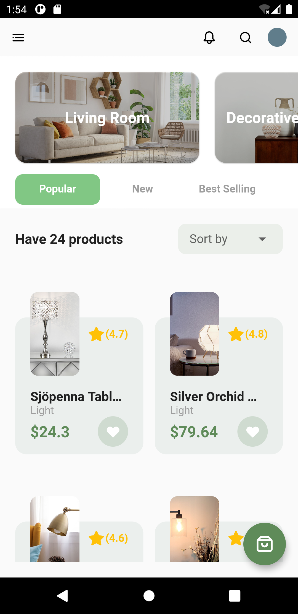
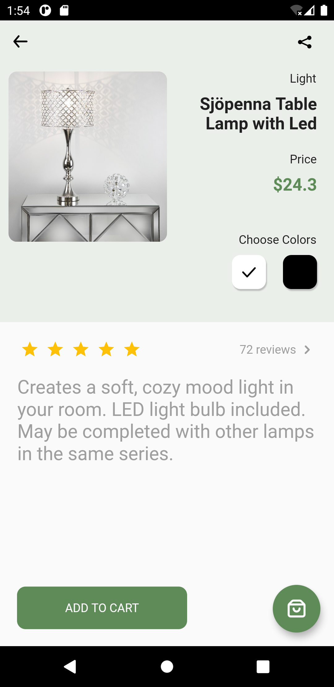
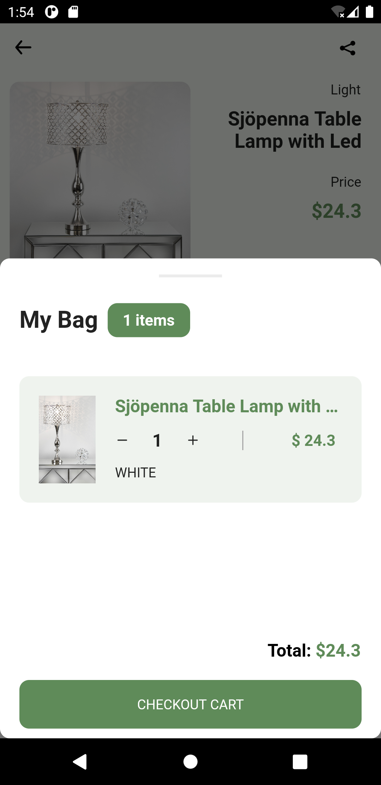
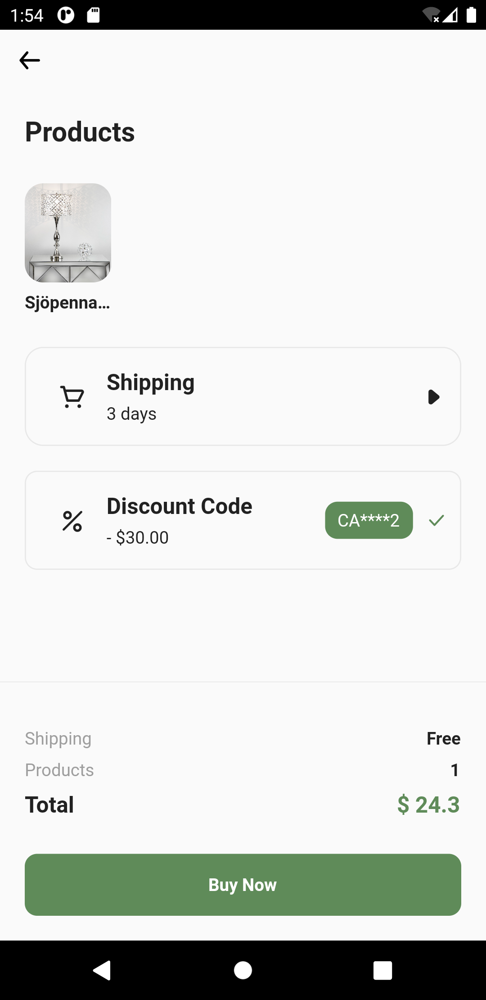
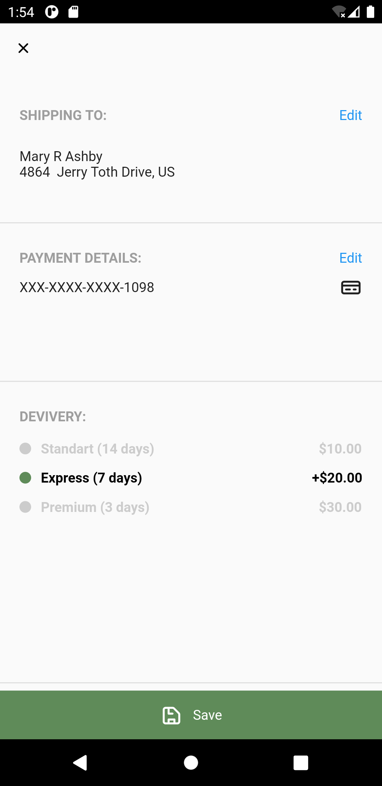
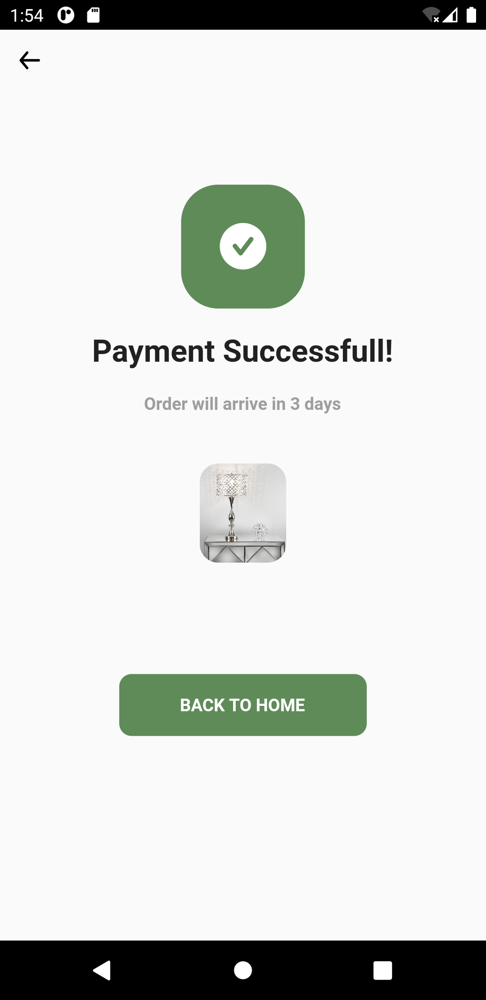

# Home Decoration Marketplace

Combine with GetX, include with sample data.

## Installation

Add Flutter to your machine

Open this project folder with Terminal/CMD and run flutter packages get

Run flutter run to build and run the debug app on your emulator/phone

## What project have ?:

- [ ] Animation
- [x] Minimal function

## Screenshot

<table style="padding:10px">
  <tr>
    <td></td>
    <td></td>
    <td></td>
  </tr>
</table>

<table style="padding:10px">
  <tr>
    <td></td>
    <td></td>
    <td></td>
  <tr>
</table>

<table style="padding:10px">
  <tr>
    <td></td>
  </tr>
</table>
